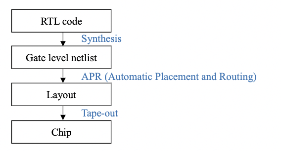
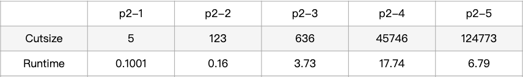
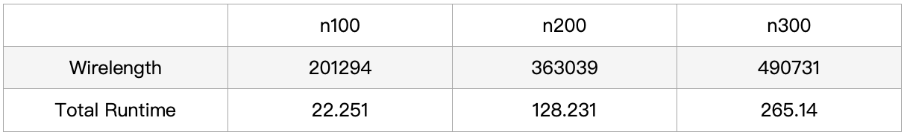
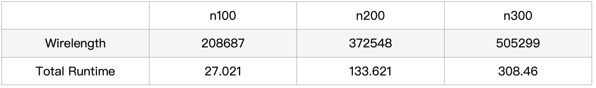
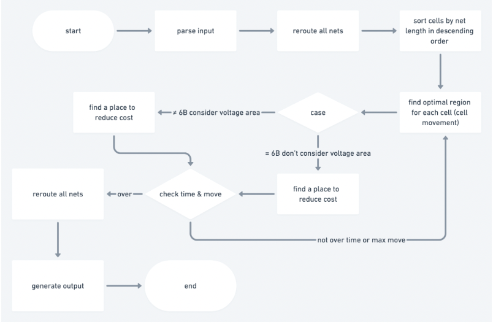
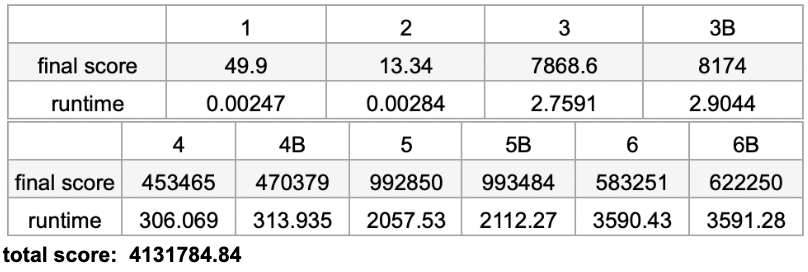

# VLSI-Physical-Design-Automation

NTHU CS. 11010 CS613500 VLSI Physical Design Automation.
 

## Homework 1: P&R Tool
- Utilize a P&R tool (Synopsys IC Compiler) to do APR (Automatic Placement and Routing) to generate a layout.

## Homework 2: Two-way Min-cut Partitioning
- Implement **FM Algorithm** to solve the problem of two-way min-cut partitioning.
- The final cut size and the runtime of each testcase 

## Homework 3: Fixed-outline Floorplan Design
- Implement **Slicing Floorplan Design by Simulated Annealing** to solve the fixed-outline floorplan design problem with a set of hard blocks
- The wirelength and runtime (sec) of each testcase with dead space ratio 0.15

- The wirelength and runtime (sec) of each testcase with dead space ratio 0.1

## Final Project: Routing with Cell Movement Advanced
- **2021 ICCAD CAD Contest Problem B**
- Base on the [repo](https://github.com/jacky860226/ICCAD-2021-B) provided by TA
- Flowchart  

- Final score & runtime  

